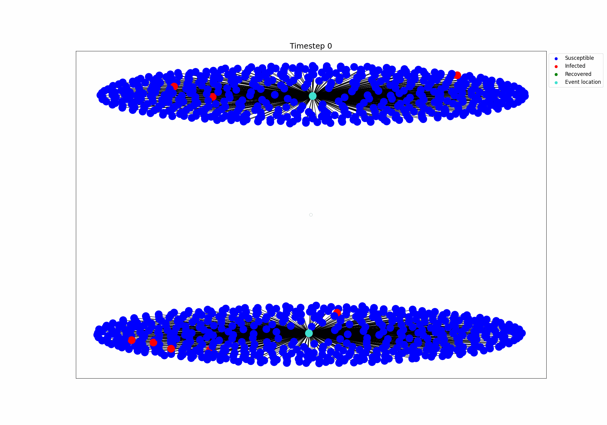
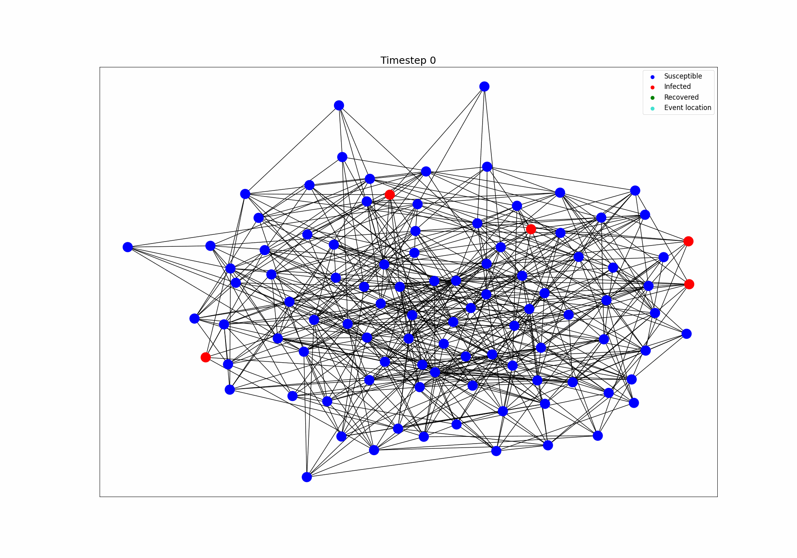
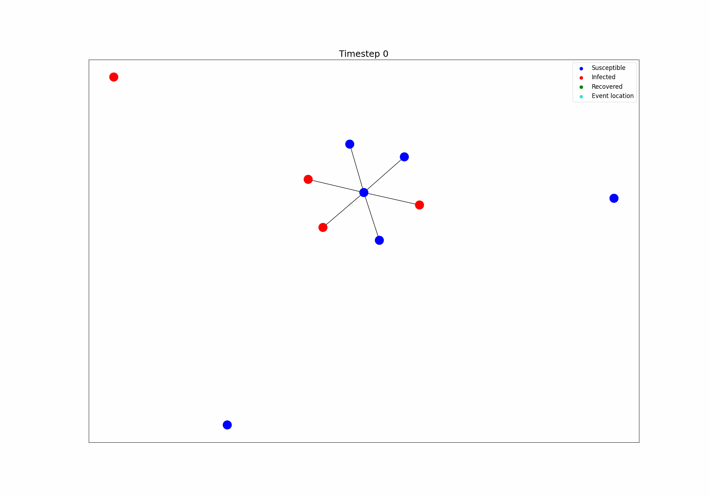
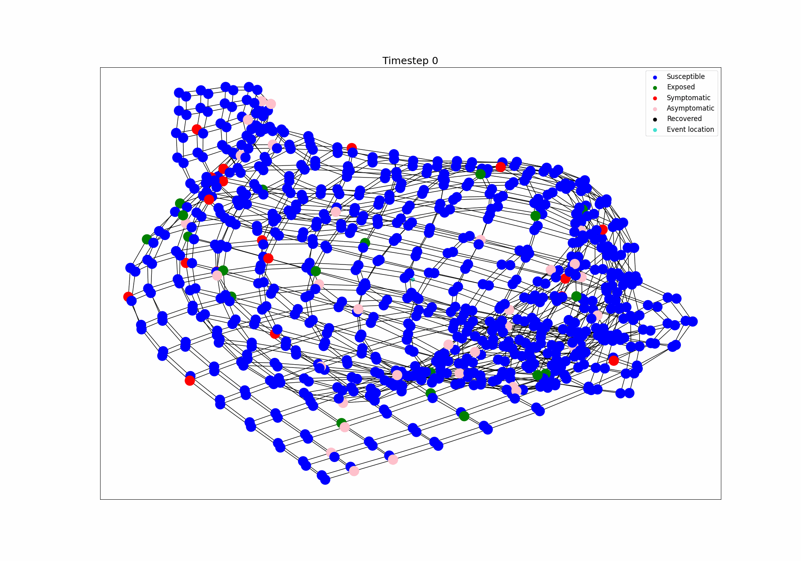
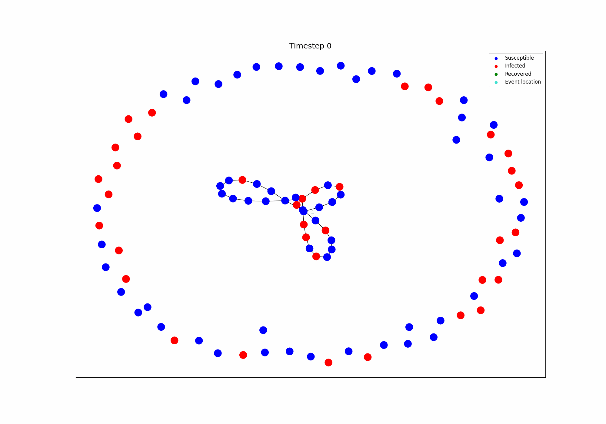
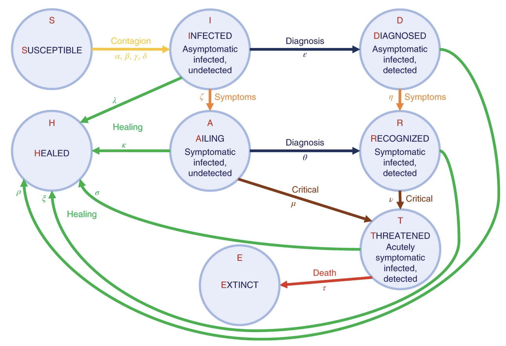

[](https://github.com/healthbadge/episimmer/actions/workflows/test.yml) [](https://episimmer.readthedocs.io/en/latest/?badge=latest) [](https://codecov.io/gh/healthbadge/episimmer) [](https://github.com/healthbadge/episimmer/blob/master/LICENSE) [](https://pypi.org/project/episimmer/)
# Episimmer : Epidemic Simulation Platform
Powered by [HealthBadge](https://www.healthbadge.org/)

Episimmer is an Epidemic Simulation Platform that aims to provide Decision and Recommendation Support to help answer your questions related
to policies and restrictions during an epidemic. Using simulation techniques widely applied to other fields, we can help schools and colleges
discover and hone the opportunities and optimizations they could make to their COVID-19 strategy.

From the most simple decisions (Which days to be online or offline) to more complex strategies (What restrictions should I put on library use?,
How many times should I test?, Whom do I test?) Episimmer is the tool for the job.

## The Environment

Episimmer is an agent-based epidemic simulator which allows you to model any kind of disease spreading environment. With the help
of simple text files, you can have your agents and the interaction network setup in no time. Here are some example
of the environments you can create.


|
:-------------------------:|:-------------------------:
<b>Completely connected agents at two locations</b>  |  <b>Random Graph G(100, 0.1)</b>

||
:-------------------------:|:-------------------------:|:-------------------------:
<b>Star Graph</b>  |  <b>Cellular Automaton</b> | <b>Multi-cycle graph</b>

The edges represent connections between the agents and the node colours represent the changing agent disease state.

But these are static networks, which aren't truly representing real-world phenomena. Episimmer allows you to have cycling dynamic networks which more closely
align with real-world social networks than static networks.

<p align = "center"> </p>
<p align = "center"> <b> Dynamic Network </b> </p>


## The Disease Model

Episimmer also allows easy creation of compartmental disease models. You can be as creative as you like, for example,

|
:-------------------------:|:-------------------------:
<b>Complex Model 1 (Taken from <a href=https://arxiv.org/abs/2007.14392>here</a>)</b>  |  <b>Complex Model 2 (Taken from <a href=https://www.nature.com/articles/s41591-020-0883-7>here</a>)</b>

<br/>

Or you could even model a fancy Zombie Apocalypse disease model like this
<p align = "center"> </p>
<p align = "center"> <b> Zombie Apocalypse </b> </p>


## Intervention Policies

There are many kinds of policies that can be implemented in Episimmer by the user and each policy is built to be flexible.
Multiple policies defined by the user can be run in a simulation seamlessly. We have also created templates for the user to test different kinds of examples of policies.

Currently, the policies that can be implemented are:

1. Lockdown Policy
2. Testing Policy
3. Vaccination Policy
4. Contact Tracing Policy


## Vulnerability Detection

Vulnerability Detection refers to finding vulnerabilities in the system that highly affect or are highly affected by
disease spread. A major part of decision support is detecting vulnerabilities in the ecosystem and taking appropriate
actions to control the disease spread.

Two kinds of Vulnerability Detection exist in Episimmer -

1. Agent-based Vulnerability Detection
2. Event-based Vulnerability Detection


For more details, check out the [official documentation](https://episimmer.readthedocs.io/en/latest/).


## Installation

### Prerequisites

Episimmer requires python 3.7+.

### Install using pip

If you are using Linux or macOS you can install episimmer from PyPI with pip:
```
pip install episimmer
```

### Install from source

Or you can install from source

1. First clone this repository:
```
git clone https://github.com/healthbadge/episimmer.git
```
2. Then, to install the package, run the following command inside the episimmer directory:
```
pip install -e .
```

3. If you do not have pip you can instead use:
```
python setup.py install
```

If you do not have root access, you should add the ``--user`` option to the above lines.


## Running Examples
To run examples -

If you installed episimmer through PyPI, run:

```
episimmer <Path_to_Example>
```

Otherwise, in the repository, run:
```
python episimmer/main.py <Path_to_Example>
```

### Command line Arguments
positional arguments:
```
example_path : Pass the path to the data folder
```

optional arguments:
```
-np or --noplot : Restrict plotting the time plot after simulation. Default = False
-vul or --vuldetect : Run Vulnerability Detection on the data folder based on VD_config.txt. Default = False
-a or --animate : Creates a gif animation of the time plot. Default = False
-s or --stats : Choose to store statistics. Default = False
-viz or --vizdyn : Creates a gif of the simulation environment progressing through the days. Default = False
```

## Tutorials

Check out Episimmer's [official documentation](https://episimmer.readthedocs.io/en/latest/) for a complete tutorial on the simulator. You may also go through these colab notebooks for a more hands-on tutorial on Episimmer:

1. [Tutorial 1 - Episimmer Basics](https://colab.research.google.com/github/healthbadge/episimmer/blob/master/scripts/Tutorial1.ipynb)
2. [Tutorial 2 - The Environment](https://colab.research.google.com/github/healthbadge/episimmer/blob/master/scripts/Tutorial2.ipynb)
3. [Tutorial 3 - Disease Modelling](https://colab.research.google.com/github/healthbadge/episimmer/blob/master/scripts/Tutorial3.ipynb)
4. [Tutorial 4 - Intervention Policies](https://colab.research.google.com/github/healthbadge/episimmer/blob/master/scripts/Tutorial4.ipynb)
5. [Tutorial 5 - Vulnerability Detection](https://colab.research.google.com/github/healthbadge/episimmer/blob/master/scripts/Tutorial5.ipynb)


## UI
Our current UI can be found at [here](https://episimmer.herokuapp.com/). Note that it has minimal functionality as compared to running the codebase directly. Yet it competes with the current state of the art systems with multiple novel features. <br>

Episimmer is currently Work in Progress. Check out these point solutions built using the Episimmer codebase. <br>

- [Optimizing Lockdowns](https://optimising-lockdowns.herokuapp.com) <br>
- [Efficient Contact tracing](https://contact-tracing.herokuapp.com) <br>
- [YACHT protocol](https://hb-yacht.herokuapp.com) <br>
- [Custom Stochastic Model on a complete graph](https://share.streamlit.io/inavamsi/custom_epidemic_model/main/main.py) <br>
- [Testing strategies (Pool testing, Friendship testing)](https://share.streamlit.io/suryadheeshjith/epidemic-testing-ui/main.py) <br>
- [Vaccination with multiple vaccine types](https://share.streamlit.io/ruthushankar/vaccination_ui/main/vac.py) <br>
