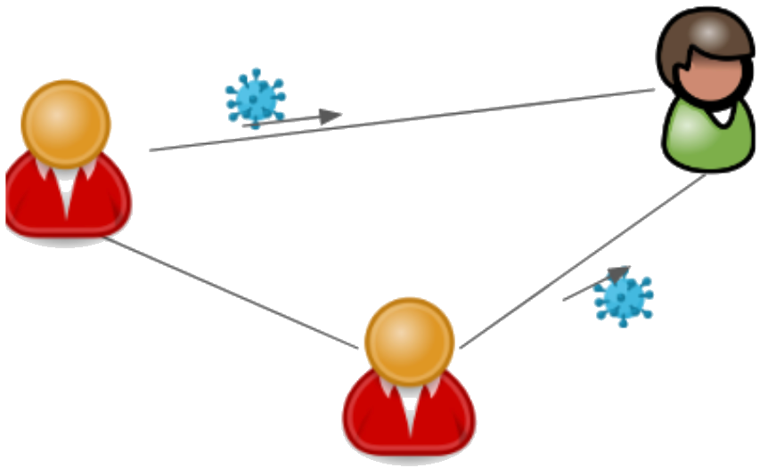
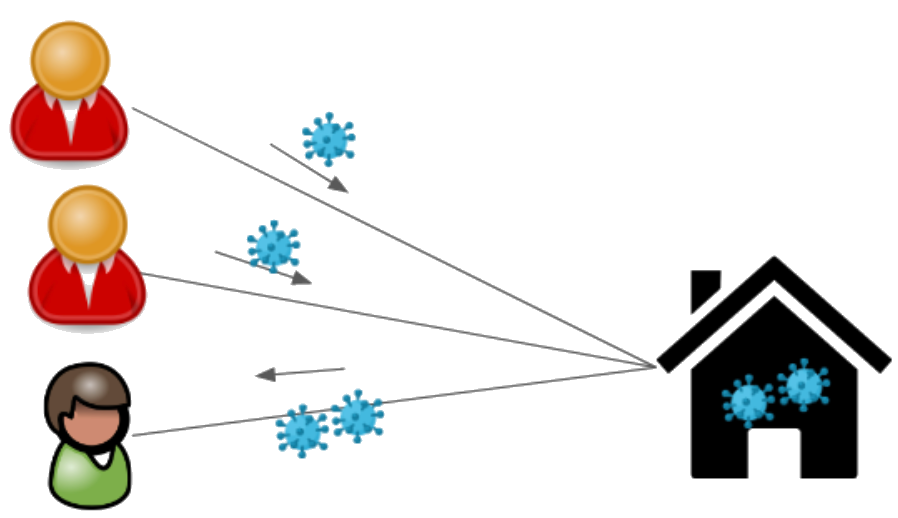

Environment
=====================================

* :ref:`Introduction - Environment`
* :ref:`Building the Environment`
* :ref:`Environment API`

Introduction - Environment
----------------------------
Episimmer is an agent-based simulation tool. An agent-based model simulates a system consisting of individual agents
behaving independently in order to understand this underlying system. In our case, the underlying system is the disease
spreading over a population of agents. We call this system, the *Environment*.

The components of the environment include :

* :ref:`Agents`
* :ref:`Individual Interactions`
* :ref:`Events and Locations`
* :ref:`One Time Events`
* :ref:`Probabilistic Interactions`

Agents
~~~~~~~~
Agent form the core of the simulation. They represent the human population in the simulation and are the carriers of the disease.
Without them, there is no simulation possible in Episimmer. Each agent can have
any number of attributes to distinguish them from the other agents and there are multiple possibilities of using these attributes
to manage their behaviour in the environment and how they are affected by it. For example, an agent can be a student in
a university or an office worker. Their attributes can differ by age, sex, blood type etc. Episimmer can model the agents
with any number of attributes and is only limited by computational resources.

Individual Interactions
~~~~~~~~~~~~~~~~~~~~~~~~
An Individual/Simple Interaction in Episimmer is the connecting interaction between two agents. If agents are the vertices of a graph,
the interactions represent the edges. An Individual interaction traditionally is a two way transaction but in the case of epidemic spread
it can be one sided. An example is agent_A leaving an elevator followed by Agent_B entering the elevator. In this case agent_A can transmit
the disease to agent_B but not vice versa. Thus, all defined interactions are one-sided, or in other words, unidirectional.

In the below figure, a susceptible agent is in contact with two infectious agents.

    Individual Interactions between 3 agents (Red-Infected, Green-Healthy)

.. note ::
    Due to the interactions being unidirectional, the natural case of interactions occur both ways between two agents. Thus, in this example,
    we would have 6 interactions rather than just 3.

What we require is the probability of an agent getting infected through all the interactions he has participated in. This probability can be later used to check whether the agent becomes infected.

The probability of getting infected for the green agent is calculated as -

.. math::

  P(Green\ infected) = 1 - P(not\ infected\ by\ Red1)\times P(not\ infected\ by\ Red2)

In a homogeneous setting where all agents have equal probability, our equation would turn out to be -

.. math::

  P(Green\ infected) = 1 - P(not\ infected\ by\ Red)^{Number\ of\ Infected}

But, Episimmer follows the first equation as the probability of infection can vary across agents.

Events and Locations
~~~~~~~~~~~~~~~~~~~~~~~~

Events are another type of interaction where they occur at a location. When you have a scenario with all agents interacting with each other, you should use Events. In graph terms, they represent a complete graph of Individual interactions.
For example, if Classroom A is a location then Elementary Physics and Elementary Chemistry are events that happen at the location of classroom A. In an event all agents involved interact with each other through
a medium called ambient infection. All infectious agents can contribute to the ambient infection and all susceptible agents can receive infection from the
ambient infection and have a chance of being infected.

Infectious agents that are part of the event contribute infection to an intermediate medium we call the ambient infection. Then, the susceptible agents receive infection from this ambient infection. Thus,
Events are modelled in two stages :

Stage i) Accumulation of ambient infection

Stage ii) Disease spread due to ambient infection

    Event with three agents (Red-Infected, Green-Healthy) at a location

The Red agents would first contribute to the ambient infection and then the Green agent would obtain a probability of infection due to the accumulated
ambient infection.

Programmatically, we need to iterate over the agents once for each stage and the event probabilities would be accessible to all the
agents. Thus, events have a time complexity of :math:`O(2n) = O(n)`.
While modelling Events as Individual Interactions (all agents connected to each other), the time complexity is of :math:`O(n^{2})` for interactions as we
save probabilities for each interaction (Number of interactions for a complete network of n-agents = :math:`\frac{n (n-1)}{2}`).

The downside to higher efficiency in Events is that we save only one probability value regardless of the number of agents in the event. This could be a costly assumption
when we have heterogeneous agents and the accumulated ambient infection isn't representative of all the agents. Thus, both Events and Individual interactions have their pros and cons.

.. note ::
    Always use Events when modelling a complete graph of interactions and you do not have information of the individual interactions.

Cycling nature of Events and Individual Interactions
~~~~~~~~~~~~~~~~~~~~~~~~~~~~~~~~~~~~~~~~~~~~~~~~~~~~~~~~~~
In the real-world, when modelling any environment, it is usually the case where we have periodic events i.e. periodic classes in a university
or periodic meetings in a corporate organisation. Thus, in Episimmer, individual interactions and events are periodic in nature.

All Environment files including Individual interactions and Events are implemented in Episimmer with the use of text files. Assuming you have a file containing individual interactions for a timestep,
in the simplest case, the simulator will run the same set of individual interactions each timestep.
If there were two files, then we would have alternating sets of individual interactions. The same applies to Events.

.. note ::
    The next two components are derivatives of the Events and Interactions components. We implement them separately
    and treat them as distinct components as they have important use cases in the real world.

One Time Events
~~~~~~~~~~~~~~~~~~
These interactions are similar to events but they do not occur periodically. This would mean that we would have to pass the timesteps at
which these events occur to the simulation. In realistic scenarios such as in a university, there are some events that do not take place periodically.
For instance, cultural week might last for only one week within a span of two months. Hence, the concept of one time events has been introduced
which helps us specify such infrequent and exceptional events in the environment.

Probabilistic Interactions
~~~~~~~~~~~~~~~~~~~~~~~~~~~~~

Probabilistic interactions are interactions that occur based on probability. This kind of interplay between the agents is different from the other kinds of connections we have seen that were strictly fixed for a simulation.
For instance, the interaction between a student and a teacher in a university can be considered to be probabilistic taking into account that the student has a consistent 95% attendance.
Hence, probabilistic interactions allow us to specify interactions between agents that are not most definitely bound to happen.
Like Events and Individual interactions, Probabilistic interactions are also cyclic in nature.

Building the Environment
--------------------------

Here we shall see how one cancreste the Environment. We can build complex regions like schools or college campuses where the agents interact with a small pre-defined
subset of agents at a given time. For example Bob interacts with 20 people in English class at 11 am followed by 30 people in Physics class at 12 noon and then has lunch with
200 people at the cafeteria. Episimmer allows you to capture these interaction patterns.

As stated before, the Environment is implemented using text files. Although there are some components where csv files are also accepted. Another point to mention is that
all the environment files are specified for simulation using the simulation configuration file - config.txt. Refer to :doc:`Simulation Configuration<simconfig>` for more details
on how to set up basic parameters of your simulation and link the Environment files in config.txt.

* :ref:`Agents file`
* :ref:`Individual Interactions file`
* :ref:`Location file`
* :ref:`Event file`
* :ref:`One-Time Event file`
* :ref:`Probabilistic Interactions file`
* :ref:`Setting up the Environment`

Agents file
~~~~~~~~~~~~~~

The structure of the agents text file is given below

.. code-block:: text
    :linenos:

    <first line contains the total number of agents>
    <second line contains the parameters of an agent separated by ‘:’>
    <third line onwards contains each agent's parameter values separated by ‘:’>

Note that the 'Agent Index' parameter is a mandatory parameter.

An example of the text file is given below

.. code-block:: text
    :linenos:

    10
    Agent Index:Type:Residence:HLA Type
    0:Visitor:Outside:B
    1:Visitor:Teacher Dorm:C
    2:Visitor:Outside:C
    3:Staff:Teacher Dorm:A
    4:Student:Dorm A:A
    5:Visitor:Dorm A:B
    6:Administration:Teacher Dorm:C
    7:Staff:Teacher Dorm:C
    8:Staff:Outside:A
    9:Teacher:Dorm B:B

The agents file can be either a text or a csv file. An example of the csv file is given below

.. code-block:: text
    :linenos:

    Agent Index,Type,Residence,HLA Type
    0,Staff,Dorm B,C
    1,Student,Teacher Dorm,C
    2,Visitor,Dorm B,A
    3,Student,Teacher Dorm,C
    4,Visitor,Dorm A,A
    5,Administration,Dorm A,B
    6,Teacher,Teacher Dorm,C
    7,Teacher,Teacher Dorm,C
    8,Visitor,Dorm B,C
    9,Visitor,Dorm B,C

Naturally, you do not require to pass the number of agents in the csv file.

Individual Interactions file
~~~~~~~~~~~~~~~~~~~~~~~~~~~~~~~~~~~

An interaction must occur between two agents and thus it requires an agent and an interacting agent who
are identified by their unique labels ‘Agent Index’ and ‘Interacting Agent Index’. Thus, these two parameters
are mandatory in the file. If one wants to create a two-sided interaction one just has to repeat the interaction
with the ‘Agent Index’ and ‘Interacting Agent Index’ reversed. Additional parameters can be added to an interaction
for example 'Interaction Time’,  ‘Distance between agents’ and ‘Mask usage at time of interaction’.

The structure of the interactions text file is given below

.. code-block:: text
    :linenos:

    <first line contains the total number of agents>
    <second line contains the parameters of an interaction separated by ‘:’>
    <third line onwards contains each interactions's parameter values separated by ‘:’>

An example of the text file is given below

.. code-block:: text
    :linenos:

    5
    Agent Index:Interacting Agent Index:Time Interval:Intensity
    10:88:6.688619668606895:0.9667447062422788
    9:95:0.9007299229441801:0.29413754832944883
    31:65:2.3104869981567724:0.13629109371609527
    76:96:3.014786047555358:0.06339801582240967
    51:45:3.131052149585477:0.4445434382525858

The interactions file can be either a text or a csv file. An example of the csv file is given below

.. code-block:: text
    :linenos:

    Agent Index,Interacting Agent Index,Time Interval,Intensity
    96,57,5.004142877127,0.42191921620925354
    54,27,5.641672551963007,0.7462919078948316
    25,8,1.794290991869778,0.8194479950290448
    48,12,0.22317783046829742,0.5930024147218874
    32,1,2.0332990080122935,0.9049495038090604

Naturally, you do not require to pass the number of interactions in the csv file.

Location file
~~~~~~~~~~~~~~~~
Events occur at specified locations while interactions are location agnostic. Locations can be defined in a file called ‘locations.txt’.
Only requirement is 'Location Index' which must be unique for every location. Additional parameters can be added by the User as required.

The structure of the locations text file is given below

.. code-block:: text
    :linenos:

    <first line contains the total number of locations>
    <second line contains the parameters of the location separated by ‘:’>
    <third line onwards contains each location's parameter values separated by ‘:’>

An example of the text file is given below

.. code-block:: text
    :linenos:

    2
    Location Index:Type:Ventilation:Roomsize:Capacity
    0:Lab:0.17931671057168175:14:33
    1:Open Air:0.29934348486313356:17:34

Event file
~~~~~~~~~~~~~~

An event must occur at a location which is specified by 'Location Index'. It also should contain the label 'Agents' which
corresponds to the 'Agent Index' of agents who have participated in the event.

The structure of the events text file is given below

.. code-block:: text
    :linenos:

    <first line contains the total number of events>
    <second line contains the parameters of the events separated by ‘:’>
    <third line onwards contains each event's parameter values separated by ‘:’>

An example of the text file is given below

.. code-block:: text
    :linenos:

    3
    Location Index:Agents:Time Interval
    1:0,91,50,25,99,16,48,67,28,96,50,4,80:10
    0:74,4,62,93,73,44,56:60
    4:7,21,89,8,27,80,40,21,5,85,48,40,47,44,77,28,83:30

One-Time Event file
~~~~~~~~~~~~~~~~~~~~~~

The One-Time events occur at specific timesteps. Thus, additional to the parameters of regular Events, we must pass the timestep
parameter.

An example of a One-Time event text file is given below

.. code-block:: text
    :linenos:

    1
    Time Step:Location Index:Agents
    1,3:0:0,1,2,3,4,5,6,7,8,9

This example will run the Event with 10 agents on timesteps 1 and 3.

Probabilistic Interactions file
~~~~~~~~~~~~~~~~~~~~~~~~~~~~~~~~~~~~

An individual file for probabilistic interactions will have ‘Probability’ and ‘Agents’ as required parameters. Thus, a line 1:1,2 represents
an edge between agent 1 and agent 2. But a line 0.5:1,2 will have an edge only in 50% of the situations that this interaction is called upon.
Furthermore 0.3:1,2,3,4 will ensure that each of the 6 edges (1-2,1-3,1-4,2-3,2-4,3-4) occur with 0.3 probability when this line is called upon.

.. note ::
    Each line represents an Erdos Renyi graph with p denoting the probability of having an edge and the agents denoting the vertices.

.. note ::
    Probabilistic interaction will consider a bidirectional interaction. Thus, an interaction confirmed between two agents would add both
    directions of interactions.

An example of a Probabilistic interaction text file is given below

.. code-block:: text
    :linenos:

    3
    Probability:Agents
    1:3,5,10,11
    0.5:0,1,2
    0.2:6,7

Setting up the Environment
~~~~~~~~~~~~~~~~~~~~~~~~~~~~~~~~
We have created the individual files but we need to follow a few more steps before we can run simulations.

1. **Cyclic Events and Interactions**

Since the Events, Individual interactions and Probabilistic interactions are all cyclic, Episimmer takes care of them
using a files list file. These files would contain the list of corresponding individual files and the Interactions/Events
are simulated according to the order of these files. Once the entire list has been simulated, it goes back to the top of
the list to simulate cyclic or periodic simulations.

The structure of these files are the same. We just have to pass the correct type of files to this files list file i.e.
the files list file for Individual interactions must contain only the Individual interactions files that are to be
simulated

For example, an individual interactions files list file called interactions_files_list.txt can look like this

.. code-block:: text
    :linenos:

    <monday_contacts.txt>
    <tuesday_contacts.txt>
    <wednesday_contacts.txt>
    <thursday_contacts.txt>
    <friday_contacts.txt>
    <saturday_contacts.txt>
    <sunday_contacts.txt>

We cycle through all the files every 7 timesteps. Similar files list files must be created for events and probabilistic interactions.

2. **The Simulation Configuration file**

The simulation configuration file is a text file called config.txt. It contains many of the parameters that are required
for simulation. Now that we have all the environment files required for simulation, we can pass them to the config.txt file.

To maintain coherency, the config.txt files also require the parameters used for agents, interactions, events etc.

Please check the next page to check how to setup your simulation configuration file.

Environment API
-----------------
* :doc:`Agent API<../modules/agent>`
* :doc:`Location API<../modules/location>`
* :doc:`Read File API<../modules/read_file>`
