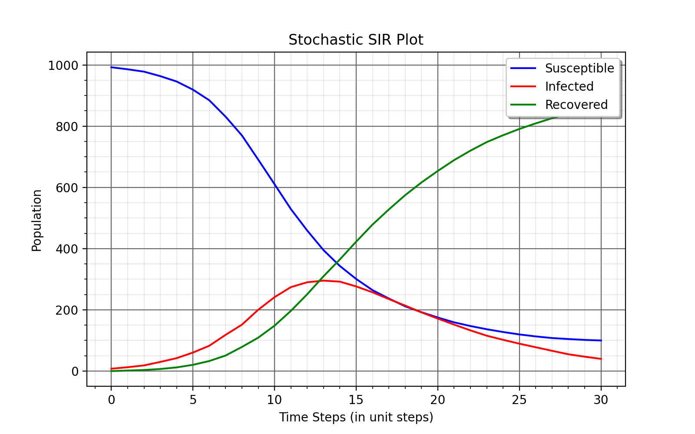

Intervention Policy
=====================

* :ref:`Introduction - Intervention Policy`
* :ref:`Implementing Policies`
* :doc:`Policy API<../modules/policy>`

Introduction - Intervention Policy
-------------------------------------

An Intervention Policy, in Epidemic terms, is a user defined intervention method which applies to any activity undertaken with the
objective of improving human health by preventing disease, or reducing the severity or duration of an existing disease.

There are many kinds of policies that can be implemented in Episimmer by the user and each policy is built to be flexible.
Multiple policies defined by the user can be run in a simulation seamlessly. We have also created templates for the user to test different kinds of examples of policies.

Currently, the policies that can be implemented are:

1. `Lockdown Policy`_
2. `Testing Policy`_
3. `Vaccination Policy`_
4. `Contact Tracing Policy`_

.. note ::
        We will look at a few population-time plots in this page. These plots represent the population of each state
        defined in the disease model at each time step. When more number of agents remain in susceptible-like states at
        the end of the simulation, it implies that the disease spread was not as severe. Lesser agents in these states
        would imply a larger disease spread.

Lockdown Policy
~~~~~~~~~~~~~~~~
Lockdowns can be implemented as user based interventions to contain the rising rate of the disease. This would mean that the agents would not
attend their regular meetings that are fixed each day and thus they do not receive any infection from these meetings.

Episimmer allows the user to define any of these Lockdowns policies -

1. *Full Lockdown* : implementing the lockdown policy for all agents

2. *Agent-Based Lockdown* : Implementing the lockdown policy for agents based on a fixed attribute of the agent

3. *Testing-Based Lockdown* : Implementing the lockdown policy for agents taking into account their test results. This policy also handles locking down contacts of positively tested agents.

4. *Event-Based Lockdown* : Implementing the lockdown policy for events based on a fixed attribute of the event.

To illustrate lockdown policies with a simple example, let us use the Agent-Based Lockdown example in
a simple university campus environment. Here, the agents are simply the students of the campus.

Let us consider three cases -
i) No lockdowns.

    Case 1

ii) Locking down agents that are in grade 1 on monday.

    Case 2

iii) Locking down agents that are in grade 1 and grade 2 on wednesday, thursday and friday.

    Case 3

We can clearly see how imposing lockdowns have created a positive effect by comparing the three figures. The case with locking down grade 1 students on monday has a slight effect compared to having no lockdown but the policy locking down both grade 1 and 2 students on wednesday, thursday and friday has a much larger effect.

Testing Policy
~~~~~~~~~~~~~~~~

Tests are procedures performed on members (subjects) on a population or population subgroup to assess the likelihood of
their members having a particular disease. Tests have only two outcomes: positive (suggesting that the subject has the
disease or condition) or negative (suggesting that the subject does not have the disease or condition). An ideal
test would have a positive result if and only if the subject actually has the disease and a negative result if
and only if the subject did not have the disease. Actual tests typically fall short of this ideal. Instead, most
screening tests exhibit what are termed false positives and false negatives to varying degrees. A Testing Policy
is a user defined intervention policy to help contain the disease spread by conducting Tests.

The user can define several factors of how the testing procedure is implemented in Episimmer. The basic pipeline of how
tests are run in episimmer is first, the agent’s test sample is collected into a “test tube” and each one of them is placed
into a “machine” that will return a result for every test tube. The user must set the relationship between the agents
and the test tubes. There are two kinds of testing methods in Episimmer - Normal (conventional testing) and Pool testing.

Normal testing is conducted when every single agent's sample goes into a single test tube. Pool testing involves multiple
agent samples in the same test tube and an agent could also have multiple samples in multiple test tubes. Pool testing
in Episimmer is defined by two parameters - Number of Agents per Test tube (NAPT) and Number of Test tubes per Agent
(NTPA). When (NAPT, NTPA) = (1, 1), Pool testing becomes Normal testing. In Pool testing, the number of
test tubes required for a given number of agents is given by -

.. math::
    N_T = \lfloor \frac{NTPA \times N_A + NAPT - 1}{NAPT} \rfloor

where :math:`N_T` and :math:`N_A` denotes the number of test tubes required and the number of agents to test respectively.

A machine has a cost, capacity, turnaround time, false positive and false negative rate associated with them. Each test
will accumulate the total cost of using the machine. The capacity determines the number of test tubes the machine can
test every time step. The turnaround time decides the number of time steps the machine takes to complete one round of
testing.

The number of tests performed each time step is also a function that can be passed as a function of time step.

Episimmer allows the user to define any of these Testing policies -

1. *Random Testing* : Randomly testing agents by normal or pool testing.

2. *Contact Testing* : Testing contacts of positively tested agents by normal or pool testing.

Illustrating testing policies with a simple example, let us see how testing can affect a certain environment. Testing
by itself will not do much to contain disease spread. We must pair a testing policy with a testing-based lockdown
policy. Thus, we lockdown agents that test positive for a period of 10 time steps.

    Without Testing

    Normal Testing

    Group Testing

The simulation with testing shows an improvement in containing the disease spread as we lockdown the agent based on whether he tested positive or not. Group
testing shows even better disease control.

Vaccination Policy
~~~~~~~~~~~~~~~~~~~

Agents of a population are vaccinated to ensure they have immunity against a certain disease. Thus, a policy for vaccination
can be enforced to counter disease spread. In Episimmer, agents are vaccinated to have immunity against a certain disease
for a fixed number of days. Vaccination has two outcomes, “Successful” or “ Unsuccessful”. A Successful vaccine will
provide immunity while an Unsuccessful vaccine will not provide immunity. The success of the vaccine is solely dependent on
the efficacy of the vaccine.

Episimmer allows the user to define any of these Vaccination policies -

1. *Single-dose Vaccination*

2. *Multi-dose Vaccination*

For single-dose vaccines, the required parameters are name, cost, count, efficacy and the decay days. Decay days are the
number of time steps an agent is protected from the disease. For multi-dose vaccines, two additional parameters, the number
of doses and interval between each dose, are needed with decay days now representing the protection days for each dose. For
each time step, the count parameter is used to generate the number of vaccines available for each type.

For both types of Vaccination policies, Agents are randomly picked and vaccinated and their result is stored in their
history. In case of multi-dose vaccines, the result of vaccination is decided in the first dosage.

Let us now look at an example of how a certain environment can enforce a vaccination policy with a limited budget. The
goal is to minimize disease spread and cost.

.. list-table:: Vaccine Choices
   :widths: 20 20 20 20 20
   :header-rows: 1

   * - Vaccine Type
     - Cost
     - Efficacy
     - Decay
     - Quantity per day
   * - A
     - 10
     - 95%
     - 40
     - 30
   * - B
     - 10
     - 70%
     - 20
     - 30
   * - C
     - 4
     - 50%
     - 35
     - 75

Running on the above settings, we get the following plots.

    Vaccine A

    Vaccine B

    Vaccine C

We have considered each environment to choose one vaccine type. According to the plots, Vaccine C performs the best
even though a vaccine of much lower efficacy is being used. The number of vaccinations compensates for its efficacy and
prevents disease spread more effectively than the other two vaccine types. These kinds of simulations can easily be
performed in Episimmer by changing a few parameters each time.

Contact Tracing Policy
~~~~~~~~~~~~~~~~~~~~~~~~~~~~

Contact Tracing is the process of obtaining contacts of positively tested agents. These contacts are important as they
are likely to have the disease depending on when they had contact. Finding contacts and testing/treating them subsequently
always has a positive impact on public health and can thereby reduce infections in the population.

In Episimmer, the user can decide who saves contacts and for how many days. This information will be used by other policies
and mitigation of the disease can be achieved. The contacts that are saved are based on all types of interactions in
Episimmer.

Two types of mitigation policies can be achieved with Contact Tracing (with the help of other policies) -

1. **Contact Tracing - Lockdown** : Once you test an agent and they turn out to be positive for the disease, the positive agent along with his contacts saved are lockdown for a set period of days. Here, the user must combine a Contact Tracing policy with a Lockdown (Testing-Based) policy.

2. **Contact Tracing - Testing** : Once you test an agent and they turn out to be positive for the disease, the contacts of the positive agent are tested for the disease. Here, the user must combine a Contact Tracing with a Testing (Contact) Policy.

Illustrating Contact Tracing with a simple example, we shall show the effect of Contact Tracing - Lockdown in a campus environment. Here, we save contacts of teachers for the past 7 time steps and lock them down for a period of 2 days.

    No Contact Tracing

    With Contact Tracing

.. note ::
        As you can see, many of the policies are linked and should be used together to contain the disease spread. Similar to Contact
        Tracing policies, we must link Testing policies with Lockdown policies to see the mitigation of disease spread.

Implementing Policies
----------------------

The GeneratePolicy.py file is where the user must define his intervention policies.

.. note ::
        This file is a mandatory file required for any simulation in Episimmer.

Let us now look at how we can implement each policy discussed.

1. `Implementing Lockdown`_
2. `Implementing Testing`_
3. `Implementing Vaccination`_
4. `Implementing Contact Tracing`_

The template of the GeneratePolicy.py file for each policy is given below -

.. code-block:: python
    :linenos:

    from episimmer.policy import xyz_policy

    def generate_policy():
        policy_list = []

        policy_object = xyz_policy.Specific_Policy()
        policy_list.append(policy_object)

        return policy_list

As shown, you must import the specific policy into your GeneratePolicy file and then have a function called generate_policy
to return a list of policies. In Episimmer, the policies inn the list will be executed in the order given in the list.

Implementing Lockdown
~~~~~~~~~~~~~~~~~~~~~~~~~~~

Let us implement each kind of Lockdown policy -

1. *Full Lockdown*

The class used to implement Full Lockdown is FullLockdown. The parameters to be passed to this class are

* do_lockdown_fn: User-defined function to specify which time step(s) to enforce lockdown in
* p: Probability of agent to contribute and receive infection from any source of infection under lockdown

An example of a GeneratePolicy.py file illustrating full lockdown policy where all agents are lockdown on
alternate days is given below

.. code-block:: python
    :linenos:

    from episimmer.policy import lockdown_policy

    def generate_policy():
        policy_list=[]

        def lockdown_fn(time_step):
            if time_step % 2 == 0:
                return True

            return False

        policy_list.append(lockdown_policy.FullLockdown(lockdown_fn))

        return policy_list

2. *Agent-Based Lockdown*

The class used to implement Agent-Based Lockdown is AgentLockdown. The parameters to be passed to this class are

* attribute: Parameter (attribute) type of agents
* value_list: List of attribute values of agents
* do_lockdown_fn: User-defined function to specify which time step(s) to enforce lockdown in
* p: Probability of agent to contribute and receive infection from any source of infection under lockdown

An example of a GeneratePolicy.py file illustrating an agent lockdown policy where agents are lockdown
based on their Grade attribute

.. code-block:: python
        :linenos:

        from episimmer.policy import lockdown_policy

        def generate_policy():
            policy_list=[]

            def lockdown_fn(time_step):
                return True

            policy_list.append(lockdown_policy.AgentLockdown('Grade',['Grade 1'],lockdown_fn))

            return policy_list

3. *Testing-Based Lockdown*

The class used to implement Testing-Based Lockdown is TestingBasedLockdown. The parameters to be passed to this class are

* do_lockdown_fn: User-defined function to specify which time steps to enforce lockdown in
* lockdown_period: Number of time steps for which an agent has to lock down
* contact_tracing: Boolean specifying whether lockdown for contacts of positively tested agents is enabled or not
* p: Probability of agent to contribute and receive infection from any source of infection under lockdown

An example of a GeneratePolicy.py file illustrating locking down positively tested agents for a period of 10 days
is given below

.. code-block:: python
    :linenos:

    from episimmer.policy import lockdown_policy, testing_policy

    def generate_policy():
        policy_list=[]

        Normal_Test = testing_policy.TestPolicy(lambda x:60)
        Normal_Test.add_machine('Simple_Machine', 200, 0.0, 0.0, 0, 50, 3, 2)
        Normal_Test.set_register_agent_testtube_func(Normal_Test.random_testing())
        policy_list.append(Normal_Test)

        ATP = lockdown_policy.TestingBasedLockdown(lambda x:True,10)
        policy_list.append(ATP)

        return policy_list

An example of a GeneratePolicy.py file illustrating locking down positively tested agents along with their contacts
for a period of 2 days is given below

.. code-block:: python
    :linenos:

    from episimmer.policy import (contact_tracing_policy, lockdown_policy,
                                  testing_policy)

    def generate_policy():
        policy_list=[]
        Normal_Test = testing_policy.TestPolicy(lambda x:7)
        Normal_Test.add_machine('Simple_Machine', 200, 0.0, 0.0, 0, 50, 3, 2)
        Normal_Test.set_register_agent_testtube_func(Normal_Test.random_testing())
        policy_list.append(Normal_Test)

        CT_object = contact_tracing_policy.CTPolicy(7)
        policy_list.append(CT_object)

        Lockdown_object = lockdown_policy.TestingBasedLockdown(lambda x:True, 2, True)
        policy_list.append(Lockdown_object)

        return policy_list

4. *Event-Based Lockdown*

The class used to implement Event-Based Lockdown is EventLockdown. The parameters to be passed to this class are

* attribute: Parameter (attribute) type of events
* value_list: List of attribute values of events
* do_lockdown_fn: User-defined function to specify which time step(s) to enforce lockdown in
* p: Probability of an event occurring during lockdown

An example of a GeneratePolicy.py file illustrating Event lockdown policy where events are lockdown based on an
Event attribute. Here, Events of Type - Low Priority are lockdown.

.. code-block:: python
    :linenos:

    from episimmer.policy import lockdown_policy, testing_policy

    def generate_policy():
        policy_list=[]

        event_lockdown = lockdown_policy.EventLockdown('Type', ['Low Priority'], lambda x: True)
        policy_list.append(event_lockdown)

        return policy_list

Implementing Testing
~~~~~~~~~~~~~~~~~~~~~~~~~~~

As mentioned previously, Testing requires us to define what method of testing is to be conducted and also requires
us to define testing machines. Let us illustrate with an example,

First, we create a TestPolicy object (as mentioned in our GeneratePolicy.py template). This class requires
a single parameter which is a callable function. This function will take parameter time step and return the number of
agents to test each time step. Let us assume we test 10 agents per time step.

.. code-block:: python
    :linenos:

    from episimmer.policy import testing_policy

    def num_agents_func(timestep):
        return 10

    def generate_policy():
        Normal_Test = testing_policy.TestPolicy(num_agents_func)

Now, we need to add a machine for testing. We use the add_machine method to do so.

:code:`add_machine(machine_name, cost, false_positive_rate, false_negative_rate, turnaround_time, capacity, valid_period, num)`

where,
machine_name: Name of machine
cost: Cost for a single test in the machine
false_positive_rate: False positive rate of the machine
false_negative_rate: False negative rate of the machine
turnaround_time: Time taken for a test result
capacity: Capacity of the machine for tests
valid_period: Number of time steps the test is considered to be valid
num: Number of instances of this machine

Let us add a Simple Machine of capacity 50 for testing.

.. code-block:: python
    :linenos:

    from episimmer.policy import testing_policy

    def num_agents_func(timestep):
        return 10

    def generate_policy():
        Normal_Test = testing_policy.TestPolicy(num_agents_func)
        Normal_Test.add_machine('Simple_Machine', 200, 0.0, 0.0, 0, 50, 3, 1)

Now, we must decide what method to use to register our agents to the test tubes. We use the set_register_agent_testtube_func method to do so.

:code:`set_register_agent_testtube_func(fn)`

where, fn: Function that determines the type of testing to be performed

Let us use Random Normal Testing i.e (NAPT, NTPA) = (1, 1).

.. code-block:: python
    :linenos:

    from episimmer.policy import testing_policy

    def num_agents_func(timestep):
        return 10

    def generate_policy():
        Normal_Test = testing_policy.TestPolicy(num_agents_func)
        Normal_Test.add_machine('Simple_Machine', 200, 0.0, 0.0, 0, 50, 3, 1)
        Normal_Test.set_register_agent_testtube_func(Normal_Test.random_testing(1,1))

Finally, let us add it to the policy list which is to be returned by the function.

.. code-block:: python
    :linenos:

    from episimmer.policy import testing_policy

    def num_agents_func(timestep):
        return 10

    def generate_policy():
        policy_list = []

        Normal_Test = testing_policy.TestPolicy(num_agents_func)
        Normal_Test.add_machine('Simple_Machine', 200, 0.0, 0.0, 0, 50, 3, 1)
        Normal_Test.set_register_agent_testtube_func(Normal_Test.random_testing(1,1))
        policy_list.append(Normal_Test)

        return policy_list

We did not add a lockdown policy for mitigation to keep the explanation simple. We shall add the lockdown policy in the
following examples.

Let us now implement each kind of Testing policy -

1. *Random Testing*

The parameters to be passed are

* num_agents_per_testtube: Number of agents per testtube (NAPT)
* num_testtubes_per_agent: Number of testtubes per agent (NAPT)
* only_symptomatic: Choose whether to only select symptomatic agents or not (If set to True, you must have symptomatic states set in ``UserModel.py``)
* attribute: Parameter (attribute) type of agents
* value_list: List of attribute values of agents

An example of a GeneratePolicy.py file illustrating normally testing random agents (and locking down positively
tested agents) is given below.

.. code-block:: python
    :linenos:

    from episimmer.policy import lockdown_policy, testing_policy

    def generate_policy():
        policy_list=[]

        Normal_Test = testing_policy.TestPolicy(lambda x:60)
        Normal_Test.add_machine('Simple_Machine', 200, 0.0, 0.0, 0, 50, 3, 2)
        Normal_Test.set_register_agent_testtube_func(Normal_Test.random_testing(1, 1))
        policy_list.append(Normal_Test)

        ATP = lockdown_policy.TestingBasedLockdown(lambda x:True,10)
        policy_list.append(ATP)

        return policy_list

.. note ::
        You may pass agent attributes and values to choose who you would like to test. You can also choose to test only
        symptomatic agents. Be sure to update your disease model if you choose this option!

An example of a GeneratePolicy.py file illustrating pool testing random agents with (NAPT, NTPA) = (3,2) (and
locking down positively tested agents) is given below

.. code-block:: python
    :linenos:

    from episimmer.policy import lockdown_policy, testing_policy

    def generate_policy():
        policy_list=[]

        Normal_Test = testing_policy.TestPolicy(lambda x:60)
        Normal_Test.add_machine('Simple_Machine', 200, 0.0, 0.0, 0, 50, 3, 2)
        Normal_Test.set_register_agent_testtube_func(Normal_Test.random_testing(3, 2))
        policy_list.append(Normal_Test)

        ATP = lockdown_policy.TestingBasedLockdown(lambda x:True,10)
        policy_list.append(ATP)

        return policy_list

2. *Contact Testing*

The parameters to be passed are

* num_agents_per_testtube: Number of agents per testtube (NAPT)
* num_testtubes_per_agent: Number of testtubes per agent (NAPT)
* attribute: Parameter (attribute) type of agents
* value_list: List of attribute values of agents

An example of a GeneratePolicy.py file illustrating normally testing random agents along with testing their contacts
in case they are positive (and locking down positively tested agents) is given below. Here, we need to also include
a contact tracing policy to save contacts each time step. Check `Implementing Contact Tracing`_ for more details on
Contact Tracing implementation.

.. code-block:: python
    :linenos:

    from episimmer.policy import (contact_tracing_policy, lockdown_policy,
                                  testing_policy)

    def generate_policy():
        policy_list=[]
        Normal_Test1 = testing_policy.TestPolicy(lambda x: 2)
        Normal_Test1.add_machine('Simple_Machine', 200, 0.0, 0.0, 0, 50, 2, 2)
        Normal_Test1.set_register_agent_testtube_func(Normal_Test1.random_testing(1, 1))
        policy_list.append(Normal_Test1)

        Normal_Test2 = testing_policy.TestPolicy(lambda x: 2)
        Normal_Test2.add_machine('Simple_Machine', 200, 0.0, 0.0, 0, 50, 2, 2)
        Normal_Test2.set_register_agent_testtube_func(Normal_Test2.contact_testing(1, 1))
        policy_list.append(Normal_Test2)

        CT_object = contact_tracing_policy.CTPolicy(7)
        policy_list.append(CT_object)

        Lockdown_object = lockdown_policy.TestingBasedLockdown(lambda x:1, 2)
        policy_list.append(Lockdown_object)

        return policy_list

Implementing Vaccination
~~~~~~~~~~~~~~~~~~~~~~~~~~~

Vaccination requires us to define which method of vaccination to implement and define the vaccines themselves.

First, we create a VaccinationPolicy object (as mentioned in our GeneratePolicy.py template). This class requires
a single parameter which is a callable function. This function will take parameter time step and return the number of
agents to vaccinate each time step. Let us assume we vaccinate 10 agents per time step.

.. code-block:: python
    :linenos:

    from episimmer.policy import vaccination_policy

        def num_agents_func(time_step):
            return 10

        def generate_policy():
            vp1= vaccination_policy.VaccinationPolicy(num_agents_func)

Now, we need to add a vaccine. We use the add_vaccines method to do so.

:code:`add_vaccines(vaccines, dosage)`

where,
vaccines: A dictionary mapping vaccine names to its parameters
dosage: Specifies if the vaccines are either ``Single`` dose or ``Multi`` dose

Parameters to be specified for single dose vaccines in the vaccines dict:

* cost: Cost of vaccine.
* count: Number of vaccine available.
* efficacy: Vaccine efficacy.
* decay: Number of days of protection offered by the vaccine.

Parameters to be specified for multi dose vaccines in the vaccines dict:

* cost: Cost of vaccine.
* count: Number of vaccine available.
* efficacy: Vaccine efficacy.
* decay: A list of number of days of protection offered by each dose of the vaccine.
* dose: Number of doses of the vaccine.
* interval: A list specifying minimum days to pass before the administration of the next dose for each dose.

Let us define a single dose vaccine.

.. code-block:: python
    :linenos:

    from episimmer.policy import vaccination_policy

        def num_agents_func(time_step):
            return 10

        def generate_policy():
            vp1= vaccination_policy.VaccinationPolicy(num_agents_func)
            vaccines1 = {
                'single': {'cost': 1, 'count': 1, 'efficacy': 1.0, 'decay': 400},
            }
            vp1.add_vaccines(vaccines1, 'Single')

Now, we must decide what method to use to register our agents to vaccines. We use the set_register_agent_vaccine_func method to do so.

:code:`set_register_agent_vaccine_func(fn)`

where, fn: Function that determines the type of vaccination to be performed

We must use random_vaccination function when we are implementing single dose vaccination.

.. code-block:: python
    :linenos:

    from episimmer.policy import vaccination_policy

        def num_agents_func(time_step):
            return 10

        def generate_policy():
            vp1= vaccination_policy.VaccinationPolicy(num_agents_func)
            vaccines1 = {
                'single': {'cost': 1, 'count': 1, 'efficacy': 1.0, 'decay': 400},
            }
            vp1.add_vaccines(vaccines1, 'Single')
            vp1.set_register_agent_vaccine_func(vp1.random_vaccination())

Finally, let us add it to the policy list which is to be returned by the function.

.. code-block:: python
    :linenos:

    from episimmer.policy import vaccination_policy

        def num_agents_func(time_step):
            return 10

        def generate_policy():
            policy_list=[]

            vp1= vaccination_policy.VaccinationPolicy(num_agents_func)
            vaccines1 = {
                'single': {'cost': 1, 'count': 1, 'efficacy': 1.0, 'decay': 400},
            }
            vp1.add_vaccines(vaccines1, 'Single')
            vp1.set_register_agent_vaccine_func(vp1.random_vaccination())
            policy_list.append(vp1)

            return policy_list

1. *Single Dose Vaccination*

An example of a GeneratePolicy.py file illustrating single dose vaccination is given below.

.. code-block:: python
        :linenos:

        from episimmer.policy import vaccination_policy

        def generate_policy():
            policy_list=[]

            vp1= vaccination_policy.VaccinationPolicy(lambda x: 100)
            vaccines1 = {
                'cov_single_dose': {'cost': 40, 'count': 20, 'efficacy': 0.9, 'decay': 40},
                'cov_single_dose2': {'cost': 50, 'count': 15, 'efficacy': 0.5, 'decay': 30},
            }
            vp1.add_vaccines(vaccines1, 'Single')
            vp1.set_register_agent_vaccine_func(vp1.random_vaccination())
            policy_list.append(vp1)

            return policy_list

2. *Multi Dose Vaccination*

 An example of a GeneratePolicy.py file illustrating multi dose vaccination is given below.

.. code-block:: python
        :linenos:

        from episimmer.policy import vaccination_policy

        def generate_policy():
            policy_list=[]

            vp2= vaccination_policy.VaccinationPolicy(lambda x: 100)
            vaccines2 = {
                'cov_multi_dose': {'cost': 40, 'count': 25, 'efficacy': 0.4, 'decay': [15, 14, 8], 'dose': 3, 'interval': [3, 2]},
                'cov_multi_dose2': {'cost': 30, 'count': 40, 'efficacy': 0.7, 'decay': [20, 25, 17, 5], 'dose': 4, 'interval': [12, 26, 14]},
                'cov_multi_dose3': {'cost': 30, 'count': 15, 'efficacy': 0.7, 'decay': [8], 'dose': 1, 'interval': []}
            }
            vp2.add_vaccines(vaccines2, 'Multi')
            vp2.set_register_agent_vaccine_func(vp2.multi_dose_vaccination())
            policy_list.append(vp2)

            return policy_list

Implementing Contact Tracing
~~~~~~~~~~~~~~~~~~~~~~~~~~~~~~~~~~~~

Implementing Contact Tracing without other policies does not help in mitigating the disease spread. We use the CT_Policy
class to implement Contact Tracing. The parameters to be passed to this class are

num_of_days : Number of days to store the agent's contacts
attribute : Parameter (attribute) type of agents
value_list: List of attribute values of agents

It saves contacts for agents of Type Teacher and Student for a period of 7 and 3 time steps respectively.

.. code-block:: python
        :linenos:

        from episimmer.policy import contact_tracing_policy

        def generate_policy():
            policy_list=[]

            CT_object = contact_tracing_policy.CTPolicy(7, 'Type', ['Teacher'])
            CT_object2 = contact_tracing_policy.CTPolicy(3, 'Type', ['Student'])

            policy_list.append(CT_object)
            policy_list.append(CT_object2)

            return policy_list

Let us implement each kind of Contact Tracing policy which uses other policies for mitigation -

1. *Contact Tracing - Lockdown*

An example of a GeneratePolicy.py file illustrating Contact Tracing for all agents followed by Lockdown for a period of
2 days is given below

.. code-block:: python
    :linenos:

    import random

    from episimmer.policy import (contact_tracing_policy, lockdown_policy,
                                  testing_policy)

    def agents_per_step_fn(cur_time_step):
        return 7

    def generate_policy():
        policy_list=[]

        Normal_Test = testing_policy.TestPolicy(agents_per_step_fn)
        Normal_Test.add_machine('Simple_Machine', 200, 0.0, 0.0, 0, 50, 5, 2)
        Normal_Test.set_register_agent_testtube_func(Normal_Test.random_testing())
        policy_list.append(Normal_Test)

        CT_object = contact_tracing_policy.CTPolicy(7)
        policy_list.append(CT_object)

        Lockdown_object = lockdown_policy.TestingBasedLockdown(lambda x:True, 2, True)
        policy_list.append(Lockdown_object)

        return policy_list

2. *Contact Tracing - Testing*

An example of a GeneratePolicy.py file illustrating Contact Tracing for all agents followed by testing contacts of positive
agents and subsequently locking down positive agents, is given below

.. code-block:: python
        :linenos:

        from episimmer.policy import (contact_tracing_policy, lockdown_policy,
                              testing_policy)

        def agents_per_step_fn(cur_time_step):
            return 2

        def generate_policy():
            policy_list=[]
            Normal_Test1 = testing_policy.TestPolicy(agents_per_step_fn)
            Normal_Test1.add_machine('Simple_Machine', 200, 0.0, 0.0, 0, 50, 2, 2)
            Normal_Test1.set_register_agent_testtube_func(Normal_Test1.random_testing())
            policy_list.append(Normal_Test1)

            Normal_Test2 = testing_policy.TestPolicy(agents_per_step_fn)
            Normal_Test2.add_machine('Simple_Machine', 200, 0.0, 0.0, 0, 50, 2, 2)
            Normal_Test2.set_register_agent_testtube_func(Normal_Test2.contact_testing())
            policy_list.append(Normal_Test2)

            CT_object = contact_tracing_policy.CTPolicy(7)
            policy_list.append(CT_object)

            Lockdown_object = lockdown_policy.TestingBasedLockdown(lambda x: True, 2)
            policy_list.append(Lockdown_object)

            return policy_list
