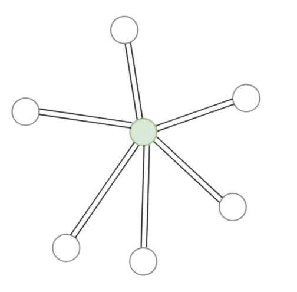
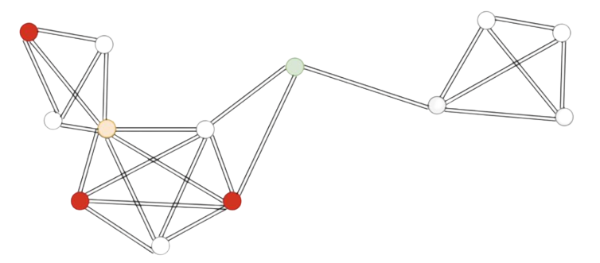

Vulnerability Detection
==========================

* :ref:`Introduction - Vulnerability Detection`
* :ref:`Implementing Vulnerability Detection`
* :doc:`Vulnerability Detection API<../modules/vulnerability_detection>`

Introduction - Vulnerability Detection
---------------------------------------

Vulnerability Detection refers to finding vulnerabilities in the system that highly affect or are highly affected by
disease spread. A major part of decision support is detecting vulnerabilities in the ecosystem and taking appropriate
actions to control the disease spread. For detection of any type of vulnerabilities in the system, we have simply used
the Monte Carlo method. `Monte Carlo methods <https://en.wikipedia.org/wiki/Monte_Carlo_method#:~:text=Monte%20Carlo%20methods%2C%20or%20Monte,might%20be%20deterministic%20in%20principle.>`_ are
a class of algorithms that rely on repeated random sampling to obtain numerical estimates of unknown parameters. The
problems that usually use this method have a probabilistic component in them. The expected value of this probabilistic
component can be estimated through Monte Carlo due to the law of large numbers. With enough data, this method can
touchdown at the truth of the problem. Using this concept, we form our vulnerability detection algorithms.
In Episimmer, there are two broad classes of Vulnerability Detection -
Agent-based Vulnerability Detection and Event-based Vulnerability Detection.

Agent-based Vulnerability Detection
~~~~~~~~~~~~~~~~~~~~~~~~~~~~~~~~~~~~~

* **Vulnerable Agents** : Agents who are most likely to reach a certain disease state. For example ‘agents most likely to die’ or ‘agents most likely to get infected’ or ‘agents most likely to be hospitalised’.
* **Agent Vulnerabilities** : The Agent on removal or constrained for a duration of time from the ecosystem, lead to the largest reduction in risk or size of the epidemic. This can be viewed as disconnecting parts of the system to stop spread of a disease.

While running a VD module, every agent has an associated agent score. Vulnerable agents will have higher scores when they seem to be getting into the vulnerable states specified, more than the other agents. Thus, a higher score indicates a relative more vulnerable agent.
Agent vulnerability scores correspond to the agents influence when removed from the environment, considering the agent vulnerability states specified. For example, if we consider a 'Dead' disease state as the agent vulnerability state, when we remove an agent, say Agent A,
his absence in the environment might be critical to reducing deaths.

.. note ::
        Some of the Agent vulnerability algorithms have lower score corresponding to a higher agent vulnerability for the states specified. Do not get confused when you see the lowest value
        for scores of highest agent vulnerabilities.

We shall look at some theoretical graphs to further differentiate the two types.
In a simple star graph shown below, it is evidently clear that the central node is the largest vulnerability which on removal completely slows the spread. Furthermore, the central node is also the largest vulnerable agent as he has the most number of interactions.

    Star Graph

In the next example, a complex graph is shown in which the vulnerable agent and agent vulnerability nodes are different. Assuming the red nodes are the infected nodes, the most vulnerable agent is the orange node, while the agent vulnerability is the green node. On removal of the green node, we save 4 other agents but removing the orange node will not change the epidemic size. Finding these vulnerabilities would allow us to create more efficient intervention policies specialised for communities that have data the environment of their community.

    Complex Graph

Thus, finding these vulnerabilities can help us target agents that require special attention through intervention policies.

In Episimmer, the user is allowed to choose any of the algorithms for Agent-based Vulnerability Detection.

Under Vulnerable Agents, the algorithms available to the user are :

* *SimpleVulnerableAgent*

This algorithm scores the agent based on the number of times he was infected in multiple simulations.

.. math::
        Agent\ Score = \sum_{i=0}^{N-1}{ 1[Agent\ Infected]}

where N refers to the total number of simulation runs.

* *EarlyVulnerableAgent*

This algorithm scores the agent based on the number of times he was infected in multiple simulations and also given a higher score if he was infected earlier.

.. math::
        Agent\ Score = \sum_{i=0}^{N-1}(Total\ Timesteps - Timestep\ Infected)

where N refers to the total number of simulation runs. Note that if the agent was not infected, his score for
that run would be 0.

Under Agent Vulnerabilities, the algorithms available to the user are :

* *SimpleAgentVulnerability*

This algorithm scores the agent based on the severity of outbreak after the agent's removal. Multiple simulations are run by randomly selecting and removing an agent and running the simulation. The agent score is calculated by finding the running average of scores for each run.

.. math::
        Agent\ Score = 1 - \frac{Total\ Agents\ Infected}{Total\ Agents}

* *ChunkAgentVulnerability*

This algorithm scores the agent based on the severity of outbreak after the agent's removal. Multiple simulations are run by randomly selecting and removing an agent and running the simulation. The agent score is calculated by finding the running average of scores for each run. For higher stability, chunks of the entire simulation are considered instead of the entire simulation.

.. math::
        Agent\ Score = \sum_{i=0}^{N-1}((Agents\ Infected\ at\ timestep\ \gamma) - (Agents\
                            Infected\ at\ timestep\ \beta))

where :math:`\beta` is a randomly generated integer based on the user defined parameters for chunk length, and
:math:`\gamma` = :math:`\beta` + :math:`chunk\ length` - 1. N refers to the total number of simulation runs.

* *BanditAlgos*

This algorithm implements the Agent Vulnerability module with Bandit Algorithms.

We first select an agent for removal based on either epsilon greedy or the UCB1 algorithm, then we run the
simulation.

**I) Agent Selection**

*Epsilon Greedy*

Random selection of agent done with probability :math:`\epsilon` and greedy (highest scoring agent) selection of
agent with probability 1 - :math:`\epsilon`.

*UCB1*

Selection of agent based on equation -

.. math::
        \arg \max_{a} \bigg( running\ avg\ score_{a} + \sqrt{\frac{2 \log{t}}{N_t(a)}} \bigg)

where :math:`a` represents an agent and :math:`N_t(a)` represents the number of times agent :math:`a` has been
selected for removal.

**II) Agent Score**

After removal, the simulation is run to get the score of the removed agent. Score of the agent is based on the
severity of outbreak after the agent's removal.

The agent score is calculated by finding the running average of scores for each run. The score for a single run is
given by -

.. math::
        Agent\ Score = 1 - \frac{Total\ Agents\ Infected}{Total\ Agents}

Event-based Vulnerability Detection
~~~~~~~~~~~~~~~~~~~~~~~~~~~~~~~~~~~~~

* **Event Vulnerability** : The Events that are likely to be the highest vulnerability in the ecosystem. Similar to Agent Vulnerability, we score Events based on the amount of disease spread caused by the said Event.

Event Vulnerabilities are similar to Agent Vulnerabilities as we find the Events responsible for high disease spread. Unlike Agent Vulnerabilities, only a single event is allowed to run in a simulation while all other events do not and finally we score the event.
Finding Events that are high vulnerabilities is also important as finding individual agent vulnerabilities may not be very helpful in a large system.

In Episimmer, there is only one algorithm implemented for Event Vulnerability -

*SimpleEventVulnerability*

This algorithm implements the Simple Event Vulnerability module. This class scores the event based on the severity of outbreak after locking down all other events. Multiple simulations are run by randomly selecting an event. The event score is calculated by finding the running average of scores for each run.

.. math::
        Event\ Score = \frac{Total\ Agents\ Infected}{Total\ Agents}

Implementing Vulnerability Detection
--------------------------------------------------------

This section will describe how the user can implement Vulnerability Detection (VD) in the simulations. Two files are required to
be added for Vulnerability Detection. They are the vd_config.txt file and parameters file. We will begin by describing
the format of these two files first and then illustrate the different modules described above with examples.

* `vd_config.txt file`_
* `Parameters file`_
* `Agent VD`_
* `Event VD`_

vd_config.txt file
~~~~~~~~~~~~~~~~~~
The vd_config file has a specific format and is shown below.

.. code-block:: text
    :linenos:

    VD Target <>
    VD Algorithm <>
    Algorithm Parameter File <>
    Pre Processing <>
    Post Processing <>
    Output Mode <>

VD Target field refers to whether the Vulnerability Detection (VD) algorithm must target Agents or Events. Thus, the target
value can be Agent or Event.

VD Algorithm field refers to the Algorithm that must be used for Vulnerability Detection. Do note that each target has different
algorithms available to it. For Agent Target, algorithms could be - SimpleVulnerableAgent, EarlyVulnerableAgent, SimpleAgentVulnerability,
ChunkAgentVulnerability and BanditAlgos. For Event Target, only one algorithm can be used - SimpleEventVulnerability.

Algorithm Parameter File field contains the parameters file which contains the parameter values required by the algorithm. The name of
the Parameters file must be given here.

Pre Processing and Post Processing fields refer to operations done before and after the VD simulations. You can leave
both of these fields blank for now.

Output Mode refers to what should be printed after the completion of the entire process of VD (after Post processing). Currently,
there is only a single Output Mode - Default.

Parameters file
~~~~~~~~~~~~~~~~~~~~
This file contains the parameters of the specific Vulnerability Detection algorithm to be used. It must be a json file
and the name of this file must be passed in the *Algorithm Parameter File* field in the vd_config.txt file. An example is shown below

.. code-block:: json
    :linenos:

    {
        "states":["Infected","Recovered"],
        "num_runs":100,
    }

All algorithms have the states and num_runs parameters. States refers to the states in the simulation that are infectious or post-infectious while
num_runs refers to the total number of simulation runs. In most disease models, you should have a "Susceptible" state, and at the end of a
simulation, the agents belonging to this state were the only ones that were not affected by the disease. This would mean that all the other agents
were infected at some point in time. This is why you must choose all the agent states that are considered to be either infected or passed an infected
state at some point in time. For example, if the SIR model is used, the VD states you should choose are both the Infected(I) and Recovered(R) states.

Agent VD
~~~~~~~~~~~~~

Agent VD has the following algorithms that can be implemented in the simulation. One of the following algorithms must be
used in the *VD Algorithm* field in the vd_config.txt file when the *VD Target* field is set to Agent.

Vulnerable Agents

* `SimpleVulnerableAgent`_
* `EarlyVulnerableAgent`_

Agent Vulnerabilities

* `SimpleAgentVulnerability`_
* `ChunkAgentVulnerability`_
* `BanditAlgos`_

SimpleVulnerableAgent
^^^^^^^^^^^^^^^^^^^^^^^^^^^

The Algorithm Parameter File in the vd_config file must contain the parameters states and num_runs.

'states' refers to the states in the simulation that are infectious or post-infectious

'num_runs' refers to the total number of simulation runs

An example of the vd_config.txt file and the algorithm parameter file (parameter.json) is given below

.. code-block:: text
        :caption: vd_config.txt
        :linenos:

        VD Target <Agent>
        VD Algorithm <SimpleVulnerableAgent>
        Algorithm Parameter File <parameter.json>
        Pre Processing <>
        Post Processing <>
        Output Mode <Default>

.. code-block:: json
        :caption: parameter.json
        :linenos:

        {
            "states":["Infected","Recovered"],
            "num_runs":100
        }

EarlyVulnerableAgent
^^^^^^^^^^^^^^^^^^^^^^^^^^^

The Algorithm Parameter File in the vd_config file must contain the parameters states and num_runs.

'states' refers to the states in the simulation that are infectious or post-infectious

'num_runs' refers to the total number of simulation runs

An example of the vd_config.txt file and the algorithm parameter file (parameter.json) is given below

.. code-block:: text
        :caption: vd_config.txt
        :linenos:

        VD Target <Agent>
        VD Algorithm <EarlyVulnerableAgent>
        Algorithm Parameter File <parameter.json>
        Pre Processing <>
        Post Processing <>
        Output Mode <Default>

.. code-block:: json
        :caption: parameter.json
        :linenos:

        {
            "states":["Infected","Recovered"],
            "num_runs":100
        }

SimpleAgentVulnerability
^^^^^^^^^^^^^^^^^^^^^^^^^^^

The Algorithm Parameter File in the vd_config file must contain the parameters states, num_runs and
num_agents_to_remove.

'states' refers to the states in the simulation that are infectious or post-infectious

'num_runs' refers to the total number of simulation runs

'num_agents_to_remove' refers to the number of agents to be removed

An example of the vd_config.txt file and the algorithm parameter file (parameter.json) is given below

.. code-block:: text
        :caption: vd_config.txt
        :linenos:

        VD Target <Agent>
        VD Algorithm <SimpleAgentVulnerability>
        Algorithm Parameter File <parameter.json>
        Pre Processing <>
        Post Processing <>
        Output Mode <Default>

.. code-block:: json
        :caption: parameter.json
        :linenos:

        {
            "states":["Infected","Recovered"],
            "num_runs":100,
            "num_agents_to_remove":1
        }

ChunkAgentVulnerability
^^^^^^^^^^^^^^^^^^^^^^^^^^^

The Algorithm Parameter File in the vd_config file must contain the parameters states, num_runs,
num_agents_to_remove and chunk_len_range.

'states' refers to the states in the simulation that are infectious or post-infectious

'num_runs' refers to the total number of simulation runs

'num_agents_to_remove' refers to the number of agents to be removed

'chunk_len_range' refers to the range of time steps the simulation should be run (default  = [1,50])

An example of the vd_config.txt file and the algorithm parameter file (parameter.json) is given below

.. code-block:: text
        :caption: vd_config.txt
        :linenos:

        VD Target <Agent>
        VD Algorithm <ChunkAgentVulnerability>
        Algorithm Parameter File <parameter.json>
        Pre Processing <>
        Post Processing <>
        Output Mode <Default>

.. code-block:: json
        :caption: parameter.json
        :linenos:

        {
            "states":["Infected","Recovered"],
            "num_runs":100,
            "num_agents_to_remove":1,
            "chunk_len_range":[1,30]
        }

BanditAlgos
^^^^^^^^^^^^^^^^^^^^^^^^^^^

The Algorithm Parameter File in the vd_config file must contain the parameters 'states', 'num_runs',
and 'mode'.

'states' refers to the states in the simulation that are infectious or post-infectious

'num_runs' refers to the total number of simulation runs

'mode' refers to the mode or algorithm to be used to select agent. Two options are present - 'EPS' or epsilon
greedy and 'UCB' or Upper Confidence Bound algorithm. (default = 'EPS')

An example of the vd_config.txt file and the algorithm parameter file (parameter.json) is given below

.. code-block:: text
        :caption: vd_config.txt
        :linenos:

        VD Target <Agent>
        VD Algorithm <BanditAlgos>
        Algorithm Parameter File <parameter.json>
        Pre Processing <>
        Post Processing <>
        Output Mode <Default>

.. code-block:: json
        :caption: parameter.json
        :linenos:

        {
            "states":["Infected","Recovered"],
            "num_runs":100,
            "mode":"UCB"
        }

Event VD
~~~~~~~~~~~~
Event VD has only one algorithm that is available at the moment. Thus, if VD Target is set to Event, then VD Algorithm
must be set to SimpleEventVulnerability.

SimpleEventVulnerability
^^^^^^^^^^^^^^^^^^^^^^^^^^^

The Algorithm Parameter File in the vd_config file must contain the parameters 'states', 'num_runs' and
'event_identifier'.

'states' refers to the states in the simulation that are infectious or post-infectious

'num_runs' refers to the total number of simulation runs

'event_identifier' refers to the name of the event identifier to differentiate events

An example of the vd_config.txt file and the algorithm parameter file (parameter.json) is given below

.. code-block:: text
        :caption: vd_config.txt
        :linenos:

        VD Target <Event>
        VD Algorithm <SimpleEventVulnerability>
        Algorithm Parameter File <parameter.json>
        Pre Processing <>
        Post Processing <>
        Output Mode <Default>

.. code-block:: json
        :caption: parameter.json
        :linenos:

        {
            "states":["Infected","Recovered"],
            "num_runs":1000,
            "event_identifier":"Id"
        }

The event identifier will be defined in an individual event file.

.. code-block:: text
        :caption: four_event.txt
        :linenos:

        2
        Id:Location Index:Agents
        4:1:12,17,9,7,19,11,4,1,13,3,16,2,8,10
        5:0:14,2,9,10,4,19,3,18,11,13,15,16,7,5,6,17,0
